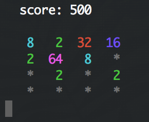

# Tty2048 [](https://travis-ci.org/lexmag/tty2048)

[2048](http://gabrielecirulli.github.io/2048) game in a terminal.



### Prerequisite

[Elixir](http://elixir-lang.org), version __1.0.0__ or later.

## Building

To build project and generate a standalone escript:

```sh
$ mix escript.build
```

This creates the `tty2048` executable.

## License

This software is licensed under [the ISC license](LICENSE).
